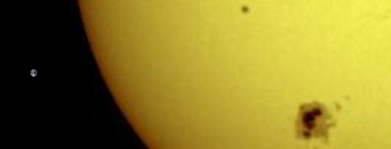
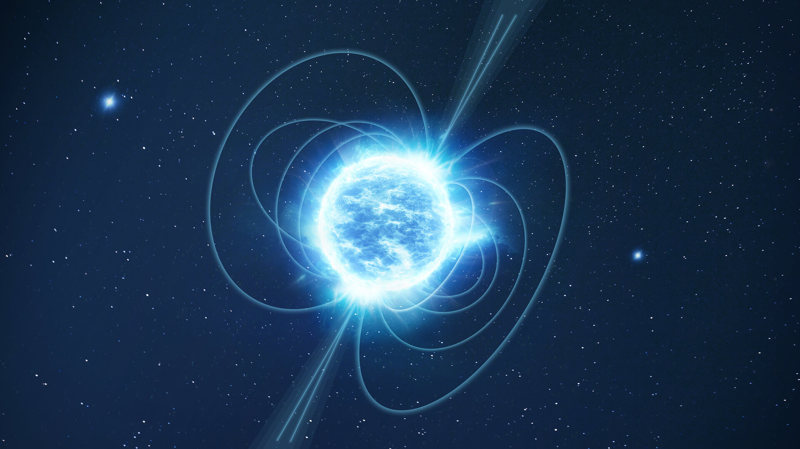

# astrocats

# ✨ Крутые Факты об Астрономии и Физике

> _«Вселенная не только страннее, чем мы себе представляем, она страннее, чем мы можем себе представить»_ — Дж. Б. С. Холдейн

---

## 🚀 Космические сюрпризы

- Одна сторона Луны всегда повернута к Земле.
  
- Солнце — гигантский шар!
  
- В нашей галактике больше звёзд, чем песчинок на всех пляжах Земли.
  
- На Венере — суперстранные сутки: один день дольше года!
  
- Следы астронавтов на Луне сохранятся миллионы лет.
  

---

## ⚡️ Физические безумства

- Чайная ложка вещества нейтронной звезды весила бы 100 миллионов тонн.
  
- Вода может существовать одновременно в трёх состояниях.
- Атомы невероятно малы: толщина листа бумаги — 1 млн атомов!
- Закон сохранения импульса: связан с симметрией пространства.
- На Юпитере и Сатурне — алмазный дождь!

---

## 🌌 Ещё интересности

- Гора Олимп на Марсе в три раза выше Эвереста!
  
- Свет от Солнца доходит до Земли за 8 минут.
  
- Сатурн бы плавал в ванной — у него плотность меньше воды.
  
- На экваторе вы весите на 3% меньше, чем на полюсе!
  

---

> *Хочешь удивить других? Добавь свой любимый факт ниже!*
